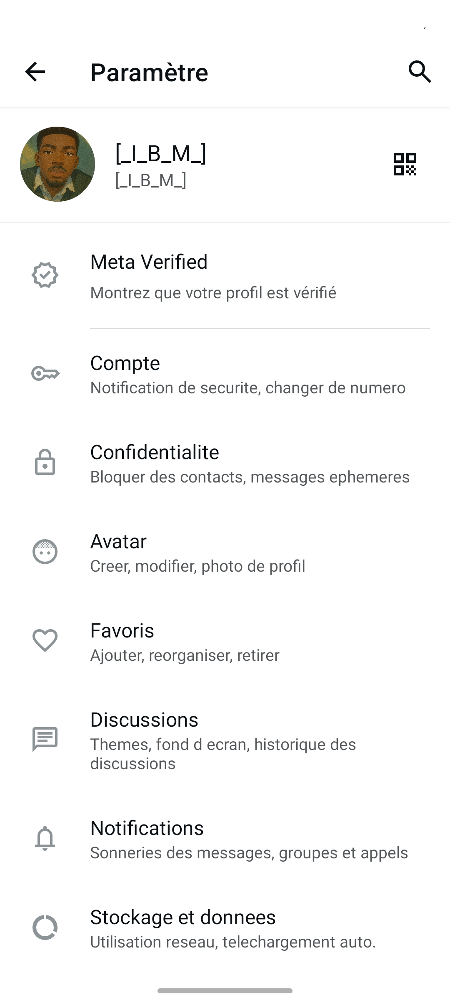
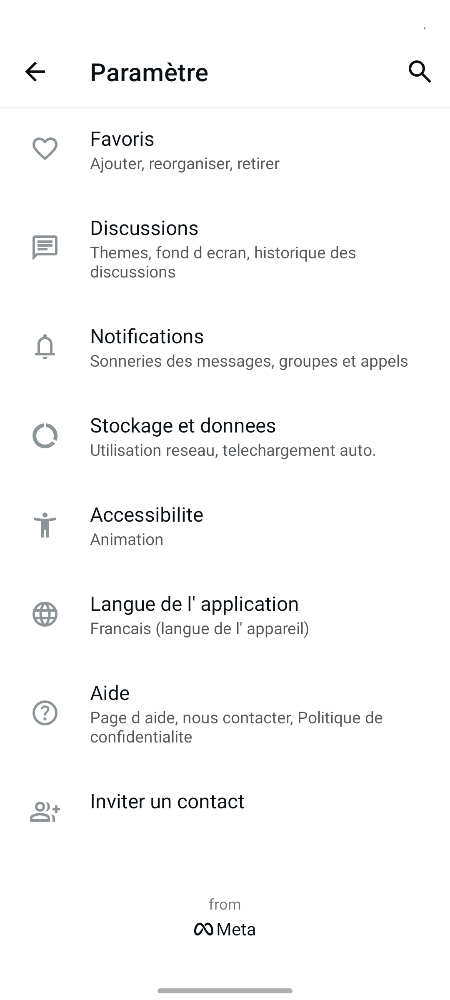
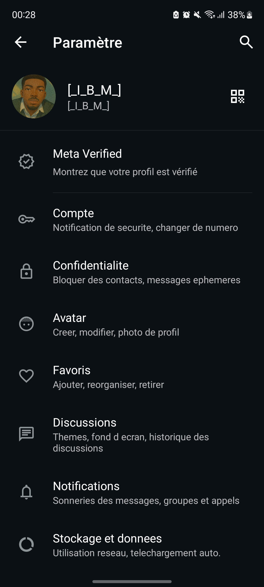
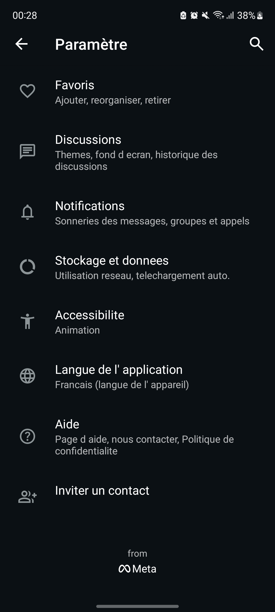

# 📱 WhatsApp Business Settings Clone  

Une réplique de l’écran **Paramètres de WhatsApp Business**, réalisée en Android avec Kotlin et Material Design.  
L’objectif est de reproduire fidèlement l’interface de WhatsApp Business en mettant en avant les sections spécifiques liées aux entreprises.  

## ✨ Fonctionnalités  

- Meta Verified
- Compte
- Confidentialité
- Avatar
- Favoris
- Discussions
- Notifications
- Stockage et donnees
- Accessibilité
- Langue de l'application
- Aide
- Inviter un contact

## ✨ Captures d'écrans
 
 
 
 

## 👨‍💻 Auteur
- Projet réalisé par Ibrahim KONDO 🚀
- 📧 Contact : ibraumodnokpro@gmail.com